# 使用云开发实时数据库搭建在线五子棋

一个简单的五子棋小游戏，如何通过云开发的巧妙接入，变成可以赛局直播的在线五子棋小游戏，快来体验尝试吧
使用云开发的数据库、实时数据库监听，登录验证使用匿名登录。

[Zira冠宇](https://github.com/wasfzxt)

---
## 创建云开发环境
>> 3min

##### 一、新建【按量计费云开发环境】
进入[腾讯云云开发控制台-创建环境](https://console.cloud.tencent.com/tcb/env/index?action=CreateEnv)，选择按量计费环境，环境名称可以自定义设置。如果已有按量计费环境则可以跳到下一步。


##### 二、开通静态网站托管服务
进入[进入静态网站控制页](https://console.cloud.tencent.com/tcb/hosting/index),选择刚才创建好的环境，开通静态网站托管服务。
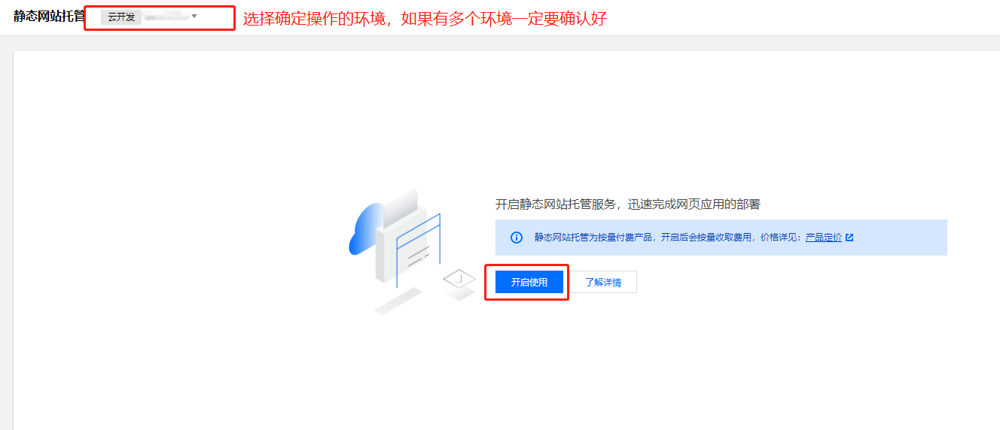

##### 三、创建数据库
进入[数据库控制页](https://console.cloud.tencent.com/tcb/database)，添加1个集合；集合名字为gobang
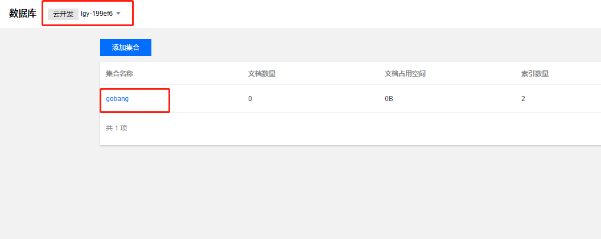

##### 四、开启匿名登录
进入[环境设置页-登录授权](https://console.cloud.tencent.com/tcb/env/login)的登录方式中，勾选匿名登录
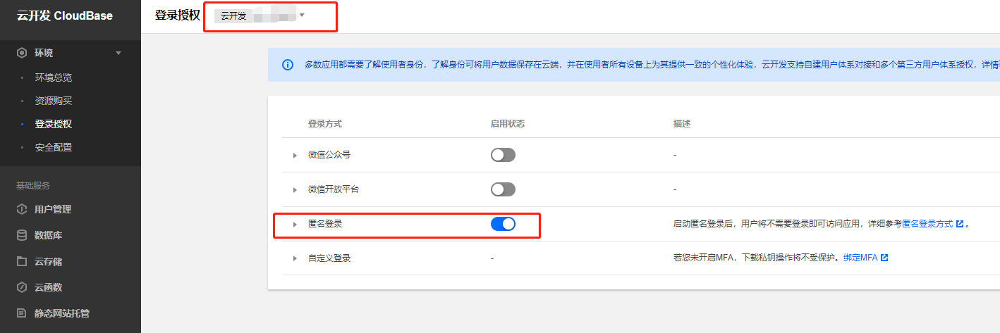

---
## 下载并部署源码
>> 6min

##### 一、下载源码
访问[github仓库](https://github.com/TCloudBase/WEB-GoBang),下载源码到本地。源码项目目录如下：
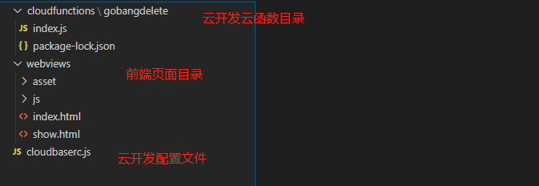

##### 二、本地运行
将项目webviews/index.html以http的形式运行，可使用IDE工具vscode，hbuilder。在浏览器的地址栏中确定url地址，比如例子中，域名地址为127.0.0.1:5500
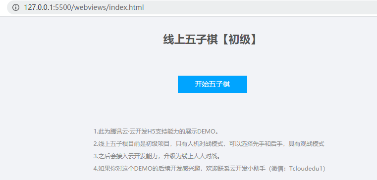

##### 四、配置本地开发的安全域名
如果想在本地开发，必须要在云开发中配置本地的安全域名才能够正常调试开发。
进入[环境设置页-安全配置](https://console.cloud.tencent.com/tcb/env/safety),配置WEB安全域名，在这里以127.0.0.1:5500举例，请按照自己的实际域名配置


##### 五、填写云开发环境ID到项目中
云开发是通过环境ID来判定与特定环境进行数据通信的，所以在项目中要配置所有的相关环境ID为自己的ID。（建议熟练后，使用配置文件形式来配置）
- 进入[环境总览页](https://console.cloud.tencent.com/tcb/env/overview),复制获取云开发环境ID。
  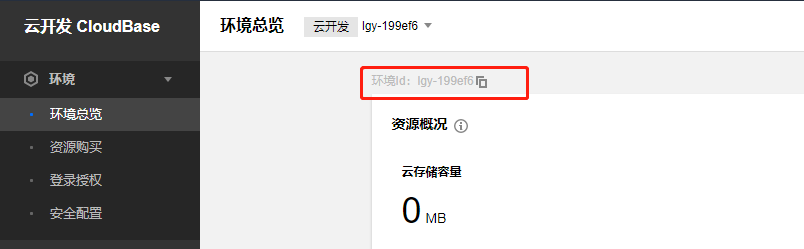
- 打开项目目录，将以下文件中标注有【云开发环境ID】处替换成自己的云开发环境ID
    - cloudfunctions/gobangselete/index.js 第3行
        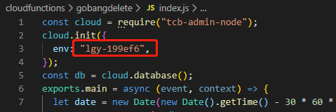

    - cloudbaserc.js 第2行
        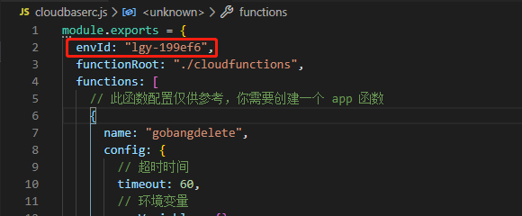

    - webviews/js下的cloud-index.js、cloud-show.js文件，第5行
        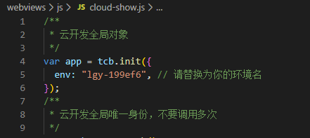

---
## 本地项目开发
>> 10min

##### 一、说明
webviews/js下的index.js和show.js都是本地五子棋的一些逻辑。其中index.js里描述的都是本地五子棋有关的操作，包括棋盘的绘制，AI的落子，监听落子等。
而cloud-index.js是外挂的云开发的相关支持。

关于cloud-index.js内的代码逻辑，请参照云开发文档学习和理解。

##### 二、将五子棋的每个落子同步到数据库中
在index.html中的函数start()，修改为如下代码：
```js
function start() {
    if (showid == null&&confirm('是否开启观看模式？其他人可以通过指定链接看到你的赛局！')) {
        cloudinit();
    } else {
        startgobang();
    }
}
```
此代码会调用cloud-index.js中的cloudinit函数，执行匿名登录，并在数据库中写入一个文档，在之后的每一次落子都会更新数据库的值。
更新触发的是cloud-index.js中的updatecall函数。

##### 三、使用实时数据库监听文档变化
show.html文件的作用是监听五子棋棋盘并同步更新，在script标签中新增如下代码：
```js
//我们使用cloudinit先做初始化，在成功之后立刻使用数据库监听
cloudinit(function(){
    var id = getQueryString().id;//使用show.js中取地址栏的参数id
    const watcher = app.database().collection('gobang').doc(id).watch({
        onChange: function(snapshot){
            downcode(snapshot);
        },
        onError: function(err) {
            console.error('the watch closed because of error', err);
        }
    })
}); 
```
此代码使用了云开发的数据库监听函数，当数据文档有变化时，会触发onchange，并调用downcode函数，执行同步绘制落子。

---
## 本地测试项目可用性
>> 5min

##### 一、重新启动项目，进入页面
点击开始落子，将会提示是否开启分享，确认后选择先下子还是后下子
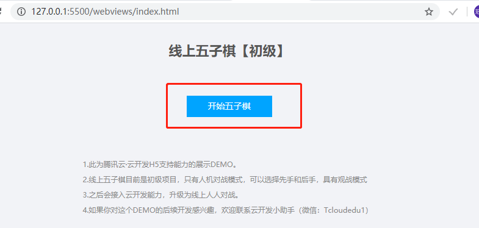
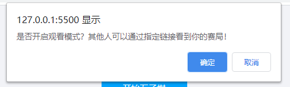

##### 二、观看棋局
如果点击开启分享，则在棋盘下方会有观看链接
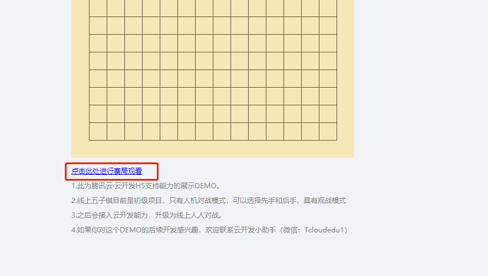

点击链接即可跳转到show页面
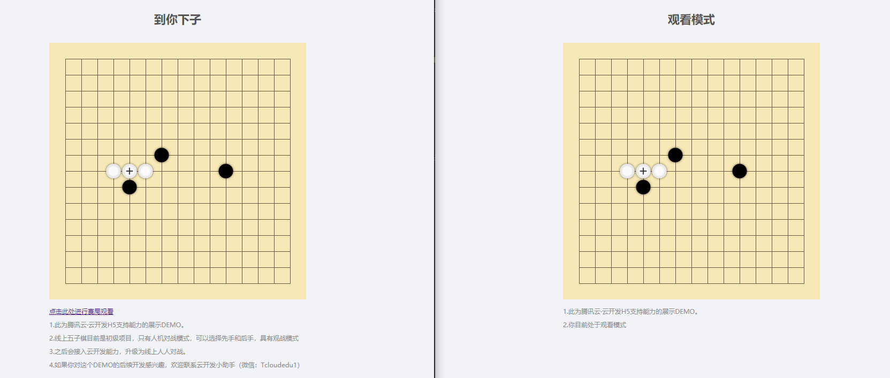

##### 三、总结
如果本地验证都没有问题，则配置没有问题。如果出现任何一个步骤的错误提示，则F12控制台查看并排除原因，一般是环境ID写错错误导致。

---
## 配置定时删除云函数
>> 3min

##### 一、说明
现在还有一个遗留的问题，那就是在数据库里，在棋局结束后没有自主销毁，会导致数据库里越来越多的无效记录。需要把这个记录定时清理一下。

##### 二、安装依赖
在cloudfunctions/gobangdelete下右键在终端打开
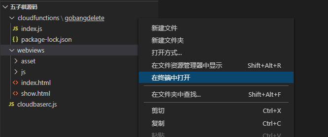

在终端中输入以下命令，安装依赖：
```bash
    npm i tcb-admin-node
```

##### 三、部署云函数
在cloudfunctions/gobangdelete目录，右键执行部署云函数（上传全部文件）。在一开始使用时会出现登录，按照提示完成登录步骤即可。【如果没有此选项，请前往[云开发VSCODE插件](https://docs.cloudbase.net/vscode/intro.html)安装并学习使用】
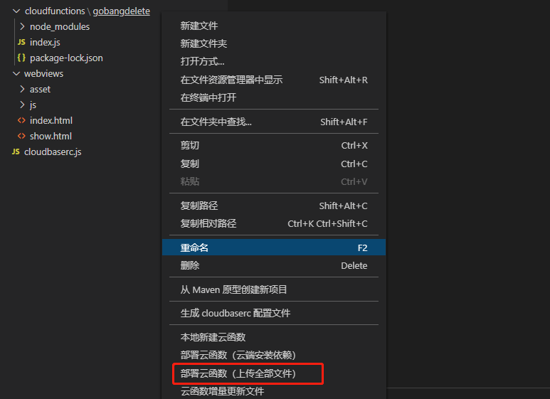

---
## 上传至静态存储
>> 2min

将本地验证成功的项目上传至静态存储中。在webviews目录右键点击，上传至静态网站根目录
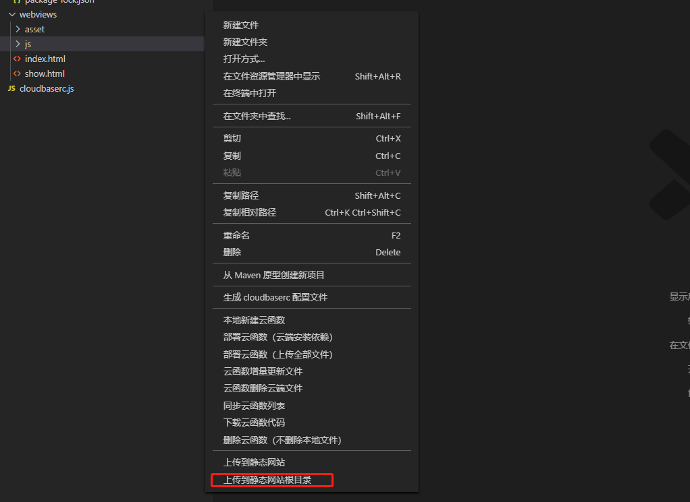

进入[云开发静态网站管理页](https://console.cloud.tencent.com/tcb/hosting/index),可以看到已上传的项目。
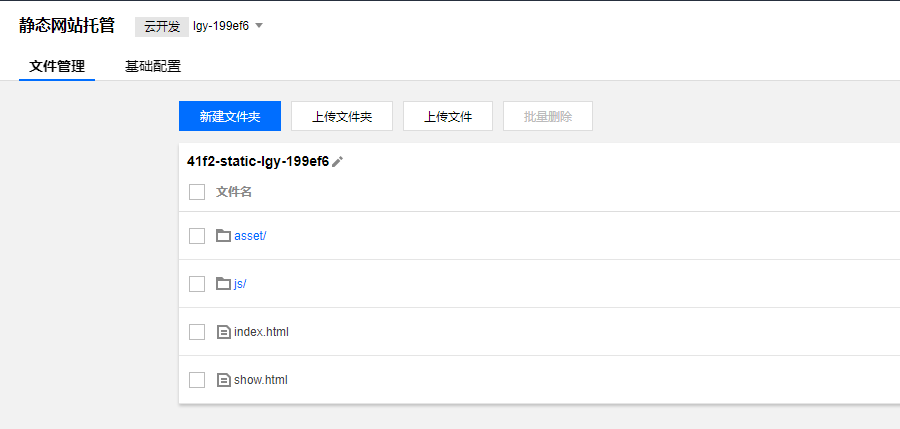

进入[云开发静态网站设置页](https://console.cloud.tencent.com/tcb/hosting/index?tabId=config),访问默认域名网址即可进入线上项目

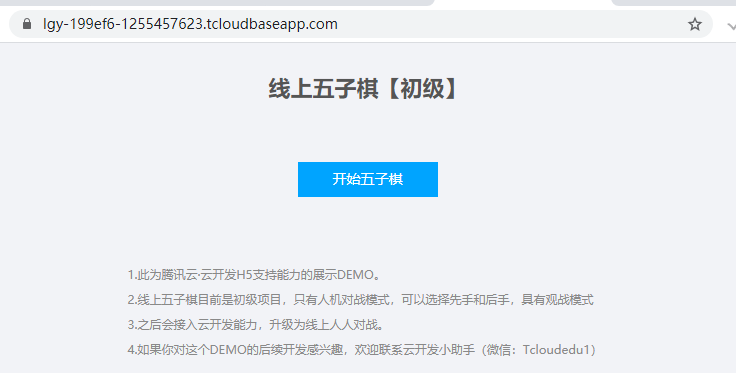

---
## 关于自定义域名和网站对外开放
>> 1min

云开发提供了完备的web端资源服务，但是一个对外公开使用的web项目需要有自己的备案域名，需要受到监管。所以，在正式对外推出之前，需要将云开发提供的默认域名替换成自己已经备案的域名

- 前往[云开发静态网站设置页](https://console.cloud.tencent.com/tcb/hosting/index?tabId=config)，在【域名信息】下点击添加域名按钮，填写已经备案的域名。域名需要配有SSL证书，腾讯云下域名会自动监测证书；如果是非腾讯云旗下域名，则需要上传SSL证书。
- 需要等待域名添加状态为【已启动】后，才可以去域名解析中配置CNAME。
- 前往[环境设置页-安全配置](https://console.cloud.tencent.com/tcb/env/safety)，在WEB安全域名中删除云开发的默认域名，只保留自定义域名。
- cloudfunctions/functions/getFile/index.js的AllowOriginList数组中，将默认域名更换成自定义域名，保存更新。